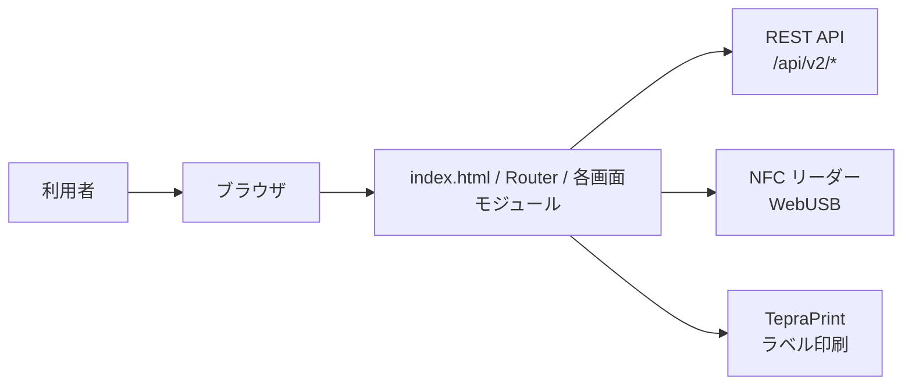

# 備品管理システム フロントエンド設計仕様書

## 1. 文書の位置付け

本書は `lims-front-v3` の現行実装を基に、フロントエンドの設計仕様を Markdown で整理したものである。  
対象はブラウザ上で動作する備品管理システムのフロントエンド実装であり、バックエンド内部実装、DB 設計、認証基盤の詳細は対象外とする。

## 2. システム概要

本システムは、研究室内の備品を管理するためのシングルページアプリケーションである。利用者は以下の業務をブラウザから実行できる。

- 備品の新規登録
- CSV による一括登録
- 備品一覧参照と一部更新
- 備品検索
- 貸出登録と返却登録
- 廃棄登録
- 管理者ログインと管理者追加登録
- 備品ジャンル管理
- テプラによるラベル印刷
- NFC リーダーによる学生証読取

## 3. システム構成

### 3.1 構成概要

### 3.2 実装方式

- `index.html` を起点とする SPA 構成
- 画面テンプレートは `modules/*/*.html`
- 画面ロジックは `modules/*/logic.js`
- 画面遷移は `js/router.js` が担当
- API 呼出しは `js/api.js` に集約
- 共通マスタ状態は `js/app_state.js` で保持
- スタイルは `css/style.css`
- 静的配信を前提とし、`Dockerfile` では `python -m http.server 8000` で配信する

### 3.3 外部連携

- バックエンド API ベース URL: `http://localhost:8443`
- HTTP クライアント: `axios` を CDN (`jsdelivr`) から ESM で読込
- NFC 読取: `NFCPortLib.js` と `navigator.usb` を利用
- 文字コード変換: `encoding-japanese` を `unpkg` から動的読込
- ラベル印刷: `js/tepraprint.js` による TepraPrint 連携

## 4. 画面一覧

| 区分 | ルートキー | 画面 | 概要 | 認証 |
| --- | --- | --- | --- | --- |
| 共通 | `main-menu` | メインメニュー | 各業務への入口 | 不要 |
| 登録 | `reg-select` | 管理方法選択 | 個別管理 / 一括管理 / CSV 登録選択 | 不要 |
| 登録 | `reg-input-1` | 新規登録 入力1 | JAN 検索または手入力 | 不要 |
| 登録 | `reg-input-2` | 新規登録 入力2 | 保管場所、購入日、登録者、ラベル設定 | 不要 |
| 登録 | `reg-confirm` | 新規登録 確認 | 登録前確認 | 不要 |
| 登録 | `reg-batch` | CSV 一括登録 | テンプレート取得、CSV アップロード | 不要 |
| 備品参照 | `item-list` | 備品一覧 | 一覧、絞込、編集、ラベル印刷 | 不要 |
| 検索 | `search-top` | 検索入力 | 備品番号 OR 備品名検索 | 不要 |
| 検索 | `search-result` | 検索結果詳細 | 1 件ヒット時の詳細表示 | 不要 |
| 検索 | `search-list` | 検索結果一覧 | 複数件ヒット時の候補一覧 | 不要 |
| 貸出返却 | `lend-return-top` | 貸出・返却トップ | 貸出 / 返却選択 | 不要 |
| 貸出返却 | `lend-input` | 貸出登録 | 入力 | 不要 |
| 貸出返却 | `lend-confirm` | 貸出確認 | 確認 | 不要 |
| 貸出返却 | `lend-history` | 貸出履歴 | 履歴表示 | 不要 |
| 貸出返却 | `return-search` | 返却対象検索 | 備品番号または貸出先検索 | 不要 |
| 貸出返却 | `return-select` | 返却候補選択 | 複数候補から選択 | 不要 |
| 貸出返却 | `return-input` | 返却登録 | 返却日、返却実行者入力 | 不要 |
| 貸出返却 | `return-confirm` | 返却確認 | 確認 | 不要 |
| 貸出返却 | `return-history` | 返却履歴 | 履歴表示 | 不要 |
| 廃棄 | `disposal-top` | 廃棄メニュー | 登録 / 履歴選択 | 不要 |
| 廃棄 | `disposal-input` | 廃棄登録 | 入力 | 不要 |
| 廃棄 | `disposal-confirm` | 廃棄確認 | 確認 | 不要 |
| 廃棄 | `disposal-history` | 廃棄履歴 | 履歴表示 | 不要 |
| 管理者 | `admin-login` | 管理者ログイン | トークン取得 | 不要 |
| 管理者 | `admin-main` | 管理者メニュー | 管理機能入口 | 必要 |
| 管理者 | `admin-register` | 管理者追加登録 | 管理者作成 | 必要 |
| 管理者 | `admin-genres` | ジャンル管理 | ジャンル追加 / 有効無効切替 | 必要 |
| 共通 | `complete` | 完了画面 | メッセージ表示、5 秒後メニュー戻り | 不要 |

## 5. ドメイン仕様

### 5.1 管理区分

| ID | 名称 |
| --- | --- |
| 1 | 個別管理 |
| 2 | 一括管理 |

### 5.2 備品ステータス

| ID | 表示名 |
| --- | --- |
| 1 | 正常 |
| 2 | 故障 |
| 3 | 修理中 |
| 4 | 貸出中 |
| 5 | 廃棄済み |
| 6 | 紛失 |

### 5.3 ジャンルマスタ

- ジャンルは `AppState` にキャッシュする
- 通常画面では有効なジャンルのみ利用する
- 管理者画面では全ジャンルを表示し、有効 / 無効を切り替える

## 6. 機能要件

### FR-01 メインメニュー

- 利用者はメインメニューから各業務画面へ遷移できること
- 遷移先は `新規登録 / 貸出・返却 / 廃棄 / 備品参照・編集 / 検索 / 管理者ログイン` を持つこと

### FR-02 新規登録

- 利用者は `個別管理` または `一括管理` を選択して登録フローを開始できること
- 入力 1 では JAN/ISBN を数値のみで受け付け、商品情報検索を実行できること
- JAN/ISBN 検索成功時は備品名とメーカーを自動補完すること
- JAN/ISBN が使えない場合、手動入力エリアを開いて備品情報を入力できること
- 手動入力項目は `備品名 / メーカー / 型番 / シリアル番号 / 数量 / 備品ジャンル` を持つこと
- 個別管理ではシリアル番号を必須とし、数量は固定 1 扱いとすること
- 一括管理では数量を入力可能とし、シリアル番号は不要とすること
- 入力 2 では `標準保管場所または所有者 / 購入日 / 登録者 / 備考 / ラベル設定` を入力できること
- 登録者は NFC 読取で入力できること
- ラベル設定は `コード種別(QR, CODE128) / テープ幅(9,12,18mm) / ハーフカット` を持つこと
- 確認画面では入力内容を一覧表示し、登録実行前に確認できること
- 登録実行時は `備品マスタ登録 -> 備品登録 -> ラベル印刷` の順で処理すること
- 登録成功時は完了画面へ遷移すること
- ラベル印刷に失敗しても、登録が成功していれば登録完了として扱うこと

### FR-03 CSV 一括登録

- 利用者は説明書 Excel と入力テンプレート CSV をダウンロードできること
- テンプレート CSV は少なくとも以下のヘッダを前提とすること  
  `備品名, 管理区分, メーカー, 型番, シリアル番号, 個数, 保管場所（所有者）, 備品ジャンル, 購入日(yyyy/mm/dd), 備考`
- CSV 取込時は空行を除外し、内部 API 取込形式へ変換できること
- 管理区分は `個別管理 / 一括管理` の日本語表記から ID へ変換できること
- 購入日は `yyyy/mm/dd` または `yyyy-mm-dd` を受け付け、RFC3339 形式へ変換すること
- 備品ジャンルはジャンルマスタ名称から ID 解決できること
- 個数は正の整数として扱うこと
- 変換後 CSV を `multipart/form-data` で API に送信できること
- 登録成功後、成功件数が 1 件以上ある場合はラベル印刷確認ダイアログを表示すること
- 利用者が許可した場合、一括登録分のラベルをまとめて印刷できること

### FR-04 備品一覧参照・編集

- 利用者は備品一覧をページング付きで参照できること
- 一覧では `管理番号 / 備品名 / 数量 / ステータス / 操作` を表示すること
- ステータスによる絞込ができること
- 1 ページ当たりの表示件数を変更できること
- 各行から編集モーダルを開けること
- 編集モーダルでは `数量 / ステータス / 標準保管場所 / 備考` を更新対象とすること
- 個別管理とみなせる備品は数量を変更不可とすること
- 貸出中の備品はステータス変更不可とすること
- 廃棄済みの備品はステータス、数量、保管場所を変更不可とすること
- 各行からラベル印刷モーダルを開けること
- ラベル印刷モーダルでは `コード種別 / テープ幅` を選択し、対象備品 1 件のラベルを印刷できること

### FR-05 検索

- 利用者は `備品番号` または `備品名` の OR 条件で検索できること
- 備品番号入力時は対象 1 件を取得する検索を行うこと
- 備品名入力時は部分一致検索を行うこと
- 検索結果が 1 件なら詳細画面へ直接遷移すること
- 検索結果が複数件なら候補一覧画面を表示すること
- 候補一覧では `管理番号 / 備品名 / 状態 / 場所または利用者` を表示すること
- 候補一覧ではステータス絞込ができること
- 候補一覧では `管理番号 / 備品名 / 状態 / 場所または利用者` でソートできること
- 詳細画面では `管理番号 / 備品名 / メーカー / 型番 / シリアル番号 / 状態 / ジャンル / 現在地または保管場所 / 購入日 / 登録者 / 備考` を表示すること

### FR-06 貸出

- 利用者は `備品番号 / 数量 / 貸出先 / 返却予定日 / 貸出実行者` を入力して貸出登録できること
- 貸出先および貸出実行者は NFC 読取入力に対応すること
- 確認画面で登録内容を表示できること
- 登録時は `management_number / quantity / borrower_id / due_on / lent_by_id` を API に送信すること
- 登録成功後は貸出入力画面へ戻ること
- 貸出履歴をページング付きで参照できること
- 貸出履歴では `備品番号 / 数量 / 貸出先 / 登録日 / 返却予定日` を表示すること

### FR-07 返却

- 利用者は `備品番号` または `貸出先` で未返却の貸出情報を検索できること
- 候補が 1 件なら返却入力画面へ直接遷移すること
- 候補が複数件なら選択画面を表示し、対象貸出を選べること
- 返却入力画面では `貸出番号 / 数量 / 貸出先` を参照表示し、`返却日 / 返却実行者` を入力できること
- 返却実行者は NFC 読取入力に対応すること
- 返却確認画面で対象と実行者を確認できること
- 登録時は `quantity / processed_by_id / note` を API に送信すること
- 返却履歴をページング付きで参照できること
- 返却履歴では `備品番号 / 数量 / 貸出先 / 貸出日 / 返却日` を表示すること

### FR-08 廃棄

- 利用者は `備品番号 / 数量 / 登録者(学生証) / 登録日 / 廃棄理由` を入力して廃棄登録できること
- 登録者は NFC 読取で入力すること
- 登録日は初期表示時に当日を自動設定すること
- 備品番号は全角英数やダッシュ揺れを正規化して扱うこと
- 確認画面で入力内容を表示できること
- 登録時は `reason / processed_by_id / quantity` を API に送信すること
- 廃棄履歴をページング付きで参照できること
- 廃棄履歴では `廃棄日時 / 管理番号 / 数量 / 廃棄理由 / 担当者` を表示すること

### FR-09 管理者認証・管理者機能

- 管理者は `学籍番号 / パスワード` でログインできること
- 学籍番号は NFC 読取入力に対応すること
- ログイン成功時は管理者トークンを保存し、管理者メニューへ遷移すること
- ログインが必要な画面に未認証で遷移しようとした場合、ログイン画面へリダイレクトすること
- 管理者はログアウトできること
- 管理者は `学籍番号 / パスワード / role=admin` を指定して追加登録できること
- 重複 ID 登録時はエラーメッセージを表示すること
- 管理者はジャンルを `名称 / コード` で追加できること
- 管理者は既存ジャンルの有効 / 無効を切り替えできること

### FR-10 共通完了画面

- 処理完了時に任意メッセージを表示できること
- 完了画面は 5 秒のカウントダウン後にメインメニューへ自動遷移すること
- 利用者が手動で即時にメニューへ戻れること

### FR-11 共通状態管理・画面遷移

- 画面テンプレートは fetch で取得し、メモリキャッシュすること
- 業務ロジックは画面遷移時に動的 import で読み込むこと
- ジャンルマスタはアプリ起動時に事前読込し、必要に応じて再利用すること
- 認証必須ルートはトークン有無を判定して表示制御すること
- 一部画面では入力値をメモリ上に保持し、確認画面や戻り操作で再利用できること

## 7. 外部 API 仕様

### 7.1 備品関連

| メソッド | パス | 用途 |
| --- | --- | --- |
| `POST` | `/api/v2/assets/masters` | 備品マスタ作成 |
| `POST` | `/api/v2/assets` | 備品作成 |
| `POST` | `/api/v2/assets/import?mode=commit` | CSV 一括登録 |
| `GET` | `/api/v2/assets/print/templates` | ラベルテンプレート取得 |
| `POST` | `/api/v2/assets/print` | ラベル印刷要求 |
| `POST` | `/api/v2/assets/print/batch` | バッチ印刷要求 |
| `GET` | `/api/v2/assets/masters` | マスタ一覧取得 |
| `GET` | `/api/v2/assets` | 備品一覧取得 |
| `GET` | `/api/v2/assets/{id}` | 備品詳細取得 |
| `GET` | `/api/v2/assets/masters/{id}` | マスタ詳細取得 |
| `GET` | `/api/v2/assets/pair/{managementNumber}` | マスタ + 備品のペア取得 |
| `PUT` | `/api/v2/assets/{id}` | 備品更新 |
| `GET` | `/api/v2/assets/summary` | 集計取得 |
| `GET` | `/api/v2/assets/search?name=...` | 備品名検索 |
| `GET` | `/api/v2/assets/lookup/{janCode}` | JAN/ISBN 検索 |

### 7.2 貸出返却

| メソッド | パス | 用途 |
| --- | --- | --- |
| `POST` | `/api/v2/lends` | 貸出登録 |
| `GET` | `/api/v2/lends` | 貸出一覧 / 未返却検索 |
| `GET` | `/api/v2/lends/{lendKey}` | 貸出詳細取得 |
| `GET` | `/api/v2/returns` | 返却履歴取得 |
| `POST` | `/api/v2/returns/key/{lendKey}` | 返却登録 |

### 7.3 廃棄

| メソッド | パス | 用途 |
| --- | --- | --- |
| `POST` | `/api/v2/assets/{managementNumber}/disposals` | 廃棄登録 |
| `GET` | `/api/v2/assets/mgmt/{managementNumber}` | 備品参照 |
| `GET` | `/api/v2/disposals` | 廃棄履歴取得 |

### 7.4 管理者・ジャンル

| メソッド | パス | 用途 |
| --- | --- | --- |
| `POST` | `/api/v2/login` | 管理者ログイン |
| `POST` | `/api/v2/register` | 管理者登録 |
| `GET` | `/api/v2/genres` | ジャンル取得 |
| `POST` | `/api/v2/genres` | ジャンル追加 |
| `PUT` | `/api/v2/genres/{id}` | ジャンル更新 |

## 8. 非機能要件

### NFR-01 実行環境

- モダンブラウザで動作すること
- ES Modules、`fetch`、`FormData`、`sessionStorage`、`Promise`、`navigator.usb` を利用可能であること
- 静的ファイルを HTTP 配信できること
- バックエンド API が `http://localhost:8443` で到達可能であること

### NFR-02 性能

- API タイムアウトは 15 秒以内とすること
- 画面テンプレートはメモリキャッシュし、同一路線の再取得を避けること
- 画面ロジックは必要時のみ動的読込し、初期ロードを軽量化すること
- ジャンルマスタは再利用し、不要な再取得を抑制すること
- 一覧系画面はページングで表示件数を制御すること

### NFR-03 可用性・障害時挙動

- API エラー時は利用者にアラートまたは画面内メッセージで通知すること
- 一覧 / 履歴の取得失敗時は画面上に失敗状態を表示すること
- 貸出、返却、廃棄、新規登録は多重送信を防止する制御を持つこと
- ラベル印刷失敗時でも、主処理が成功している場合は完了扱いにできること
- 管理者認証で `401 Unauthorized` が発生した場合はトークンを破棄し、ログイン画面へ遷移すること

### NFR-04 セキュリティ

- 管理者トークンは `sessionStorage` に保存し、ブラウザセッション単位で管理すること
- 旧実装互換として `localStorage` に残るトークンは初回読込時に `sessionStorage` へ移送し、その後削除すること
- 認証済トークンは API リクエストの `Authorization: Bearer <token>` ヘッダに付与すること
- 画面描画時は HTML エスケープを行い、基本的な XSS 混入を防止すること
- 管理者機能の UI 表示制御はフロント側でも実施するが、真正な認可判定はバックエンド側に依存すること

### NFR-05 UI/UX

- UI 文言は日本語で統一すること
- コンテンツ幅は最大 800px とし、狭い画面でも閲覧できること
- 画面切替時はフェードインアニメーションを適用すること
- フィルタ状態、ステータス状態、ページ選択状態は視覚的に識別できること
- 重要操作は確認画面または確認ダイアログを挟めること

### NFR-06 外部機器・周辺機能

- NFC 学生証読取は WebUSB 対応環境で利用可能であること
- NFC 読取はリトライを伴うこと
- ユーザーがキャンセルした場合は致命エラー扱いにしないこと
- ラベル印刷は TepraPrint ライブラリと対象プリンタが利用可能であること
- 印刷前にプリンタオンライン状態を確認すること
- ラベルテンプレートは API から取得すること

### NFR-07 保守性

- 画面テンプレートと画面ロジックは機能単位ディレクトリで分離すること
- API 呼出しは共通モジュールに集約すること
- 共通ユーティリティは `js/` 配下に配置すること
- マスタ状態やトークン状態は共通モジュール経由で扱うこと

### NFR-08 配備・運用

- ビルド工程を持たない静的配信構成であること
- Docker により簡易起動できること
- 外部 CDN 依存があるため、配備環境から `jsdelivr` および `unpkg` にアクセス可能であること

## 9. 既知の制約事項

- ブラウザ戻る履歴を厳密には管理しておらず、`Router.back()` はメインメニューへ戻す簡易実装である
- ラベル設定のハーフカットは UI 上は選択項目として見えるが、実装上は常時有効である
- 返却画面で入力する `返却日` は確認画面表示には使うが、現行フロントエンドの API payload には含めていない
- 廃棄画面で表示する `登録日` は確認用表示であり、廃棄 API payload には含めていない
- 管理者メニューの `マスタ編集` はプレースホルダであり、未実装である
- 検索条件は OR 検索であり、備品番号と備品名の複合条件検索は未対応である
- テープ幅は印刷ライブラリ側では 4/6/9/12/18/24/36mm に対応するが、画面 UI で選択できるのは 9/12/18mm のみである

## 10. 今後の拡張候補

- 検索条件の複合化
- 管理者向け備品マスタ編集
- 返却日、廃棄日のサーバ送信仕様の明確化
- 画面遷移履歴の厳密管理
- 外部 CDN 依存の排除
- 自動テストの整備
